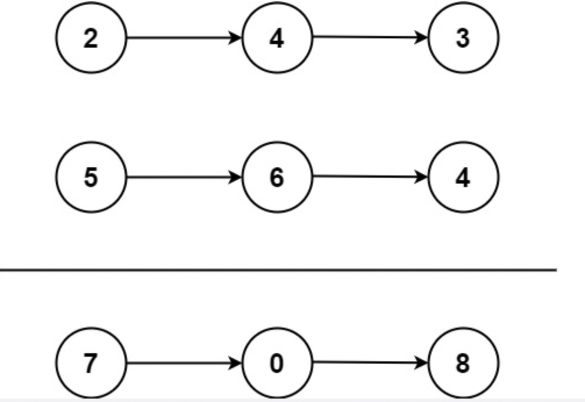

# 题目

给你两个 非空 的链表，表示两个非负的整数。它们每位数字都是按照 逆序 的方式存储的，并且每个节点只能存储 一位 数字。  
请你将两个数相加，并以相同形式返回一个表示和的链表。  
你可以假设除了数字 0 之外，这两个数都不会以 0 开头。

示例 1：



```
输入：l1 = [2,4,3], l2 = [5,6,4]
输出：[7,0,8]
解释：342 + 465 = 807.
```

示例 2：

```
输入：l1 = [0], l2 = [0]
输出：[0]
```

示例 3：

```
输入：l1 = [9,9,9,9,9,9,9], l2 = [9,9,9,9]
输出：[8,9,9,9,0,0,0,1]
```

提示：

每个链表中的节点数在范围 [1, 100] 内
0 <= Node.val <= 9
题目数据保证列表表示的数字不含前导零

# 解题思路

这道题类似于小时候做算术，从个位数开始往上计算  
同个数位上的数字相加后，如果大于等于 10 的，就留余数、进 1（每次都只会进 1，因为每个数位上最大的值是 9， 9+9 最大也就是 18）  
如果小于 10，那就不需要进位

若求和的两个链表长度分别为：m、n, 则  
**时间复杂度**：O(max(m,n))

# 代码实现

```javascript
/**
 * Definition for singly-linked list.
 * function ListNode(val, next) {
 *     this.val = (val===undefined ? 0 : val)
 *     this.next = (next===undefined ? null : next)
 * }
 */
/**
 * @param {ListNode} l1
 * @param {ListNode} l2
 * @return {ListNode}
 */
var addTwoNumbers = function (l1, l2) {
  // 结果链表
  var res = new ListNode();
  var curL1 = l1;
  var curL2 = l2;

  var l1Val = curL1.val || 0;
  var l2Val = curL2.val || 0;

  // 对相同数位上的数值进行相加，然后取相对于10的余数，这个余数就是结果链表上同样数位上的值，如进行的是个位，那这个余数就是求和结果个位上的值
  var remainder = (l1Val + l2Val) % 10;
  // 求和后相对于10求商，并且对商进行向下取整，这个就是是否需要“进1”的操作，
  // 这里也可以直接判断 l1Val + l2Val 的是否大于等于10，若是大于等于10直接赋值为1，否则赋值为0，也是可以的。
  var quotient = Math.floor((l1Val + l2Val) / 10);

  var curNode = res;
  // 余数直接赋值链表当前节点
  curNode.val = remainder;

  // 只要链表有下一个节点，那就继续执行，直到所有节点遍历完
  while (curL1.next != null || curL2.next != null) {
    var nextNode = new ListNode();
    curL1 = curL1.next || {};
    curL2 = curL2.next || {};
    l1Val = curL1.val || 0;
    l2Val = curL2.val || 0;

    // 这里上一数位的值求和后是否进1的结果值参与下一数位的计算，
    // 前面没有在循环内的之所以不需要，是因为第一个计算的肯定是个位，其前面肯定没有需要进1的
    remainder = (l1Val + l2Val + quotient) % 10;
    quotient = Math.floor((l1Val + l2Val + quotient) / 10);

    nextNode.val = remainder;
    curNode.next = nextNode;
    curNode = nextNode;
  }
  // 最后还要再判断 上一个数位的值求和后是否有 进1， 若有，结果要在增加一位数，体现在这里就是要增加下一个节点来存放该值。
  if (quotient > 0) {
    var nextNode = new ListNode();
    nextNode.val = quotient;
    curNode.next = nextNode;
  }
  return res;
};
```
