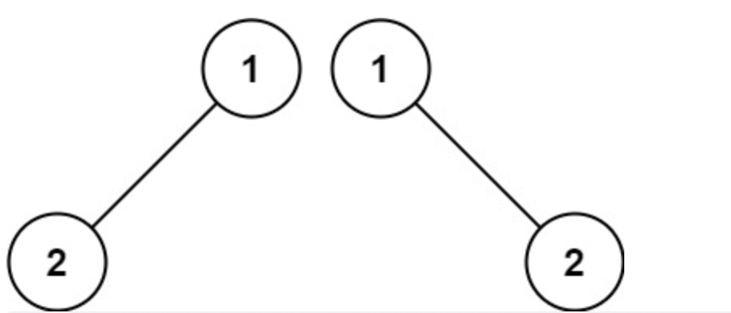

# 题目

给你两棵二叉树的根节点 p 和 q ，编写一个函数来检验这两棵树是否相同。

如果两个树在结构上相同，并且节点具有相同的值，则认为它们是相同的。

示例 1：


```
输入：p = [1,2,3], q = [1,2,3]
输出：true
```

示例 2：



```
输入：p = [1,2], q = [1,null,2]
输出：false
```

示例 3：


```
输入：p = [1,2,1], q = [1,1,2]
输出：false
```

提示：

- 两棵树上的节点数目都在范围 [0, 100] 内
- -104 <= Node.val <= 104

# 解题思路

# 代码实现

```javaScript
/**
 * Definition for a binary tree node.
 * function TreeNode(val, left, right) {
 *     this.val = (val===undefined ? 0 : val)
 *     this.left = (left===undefined ? null : left)
 *     this.right = (right===undefined ? null : right)
 * }
 */
/**
 * @param {TreeNode} p
 * @param {TreeNode} q
 * @return {boolean}
 */
var isSameTree = function(p, q) {
    return dfs(p, q);
};

var dfs = function(pNode, qNode) {
    if (!pNode && !qNode) {
        return true;
    }
    if (!pNode || !qNode || pNode.val !== qNode.val) {
        return false;
    }
    if (!dfs(pNode.left, qNode.left)) {
        return false;
    }
    if (!dfs(pNode.right, qNode.right)) {
        return false;
    }
    return true;
}
```
