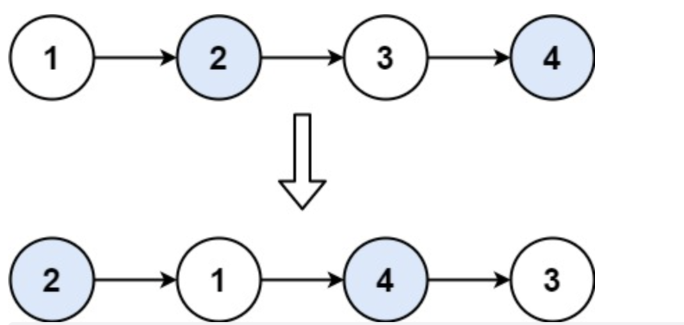

# 题目

给你一个链表，两两交换其中相邻的节点，并返回交换后链表的头节点。你必须在不修改节点内部的值的情况下完成本题（即，只能进行节点交换）。

示例 1：


```
输入：head = [1,2,3,4]
输出：[2,1,4,3]
```

示例 2：

```
输入：head = []
输出：[]
```

示例 3：

```
输入：head = [1]
输出：[1]
```

提示：

- 链表中节点的数目在范围 [0, 100] 内
- 0 <= Node.val <= 100

# 解题思路

涉及到链表会改动到头节点的，都在前面加上虚拟头节点去处理。

# 代码实现

```javascript
/**
 * Definition for singly-linked list.
 * function ListNode(val, next) {
 *     this.val = (val===undefined ? 0 : val)
 *     this.next = (next===undefined ? null : next)
 * }
 */
/**
 * @param {ListNode} head
 * @return {ListNode}
 */
var swapPairs = function (head) {
  if (head == null) {
    return null;
  }
  var node = new ListNode();
  node.next = head;
  var p = node;
  while (p.next && p.next.next) {
    var pn = p.next;
    var pnn = p.next.next;
    pn.next = pnn.next;
    pnn.next = pn;
    p.next = pnn;
    p = pn;
  }
  return node.next;
};
```
