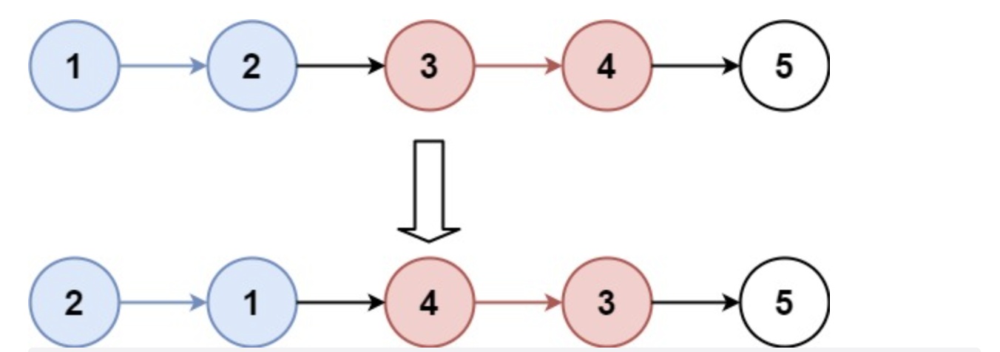
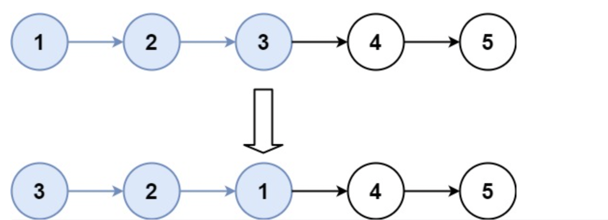

# 题目

给你一个链表，每  k  个节点一组进行翻转，请你返回翻转后的链表。

k  是一个正整数，它的值小于或等于链表的长度。

如果节点总数不是  k  的整数倍，那么请将最后剩余的节点保持原有顺序。

进阶：

- 你可以设计一个只使用常数额外空间的算法来解决此问题吗？
- 你不能只是单纯的改变节点内部的值，而是需要实际进行节点交换。

示例 1：



```
输入：head = [1,2,3,4,5], k = 2
输出：[2,1,4,3,5]
```

示例 2：



```
输入：head = [1,2,3,4,5], k = 3
输出：[3,2,1,4,5]
```

示例 3：

```
输入：head = [1,2,3,4,5], k = 1
输出：[1,2,3,4,5]
```

示例 4：

```
输入：head = [1], k = 1
输出：[1]
```

提示：

列表中节点的数量在范围 sz 内

- 1 <= sz <= 5000
- 0 <= Node.val <= 1000
- 1 <= k <= sz

# 解题思路

1. 涉及到链表会改动到头节点的，都在前面加上虚拟头节点去处理。
2. 这个题里面要 k 个为一组翻转，我们可以先把它们进行内部“箭头”（即 next 的指向）逐个先反转后，再调整当前组内的头尾。

# 代码实现

```javascript
/**
 * Definition for singly-linked list.
 * function ListNode(val, next) {
 *     this.val = (val===undefined ? 0 : val)
 *     this.next = (next===undefined ? null : next)
 * }
 */
/**
 * @param {ListNode} head
 * @param {number} k
 * @return {ListNode}
 */
var reverseKGroup = function (head, k) {
  if (k === 1) {
    return head;
  }
  let size = 0;
  let curNode = head;
  while (curNode) {
    size++;
    curNode = curNode.next;
  }
  var node = new ListNode();
  node.next = head;
  p = node;
  var len = size;
  for (; len >= k; ) {
    var count = 0;
    var a = p.next;
    var b = a.next;
    while (count < k - 1) {
      var c = b.next;
      b.next = a;
      a = b;
      b = c;
      count++;
    }
    var pn = p.next;
    pn.next = b;
    p.next = a;
    p = pn;
    len = len - k;
  }
  return node.next;
};
```
