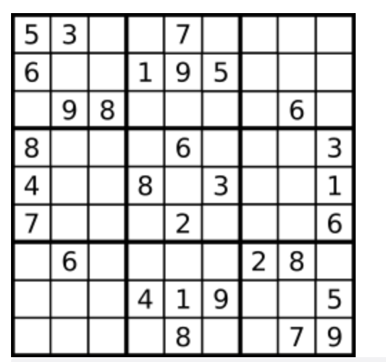
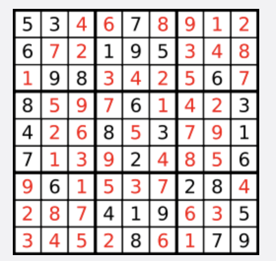

# 题目

编写一个程序，通过填充空格来解决数独问题。

数独的解法需 遵循如下规则：

数字  1-9  在每一行只能出现一次。
数字  1-9  在每一列只能出现一次。
数字  1-9  在每一个以粗实线分隔的  3x3  宫内只能出现一次。（请参考示例图）
数独部分空格内已填入了数字，空白格用  '.'  表示。

示例：



```
输入：board = [["5","3",".",".","7",".",".",".","."],["6",".",".","1","9","5",".",".","."],[".","9","8",".",".",".",".","6","."],["8",".",".",".","6",".",".",".","3"],["4",".",".","8",".","3",".",".","1"],["7",".",".",".","2",".",".",".","6"],[".","6",".",".",".",".","2","8","."],[".",".",".","4","1","9",".",".","5"],[".",".",".",".","8",".",".","7","9"]]

输出：[["5","3","4","6","7","8","9","1","2"],["6","7","2","1","9","5","3","4","8"],["1","9","8","3","4","2","5","6","7"],["8","5","9","7","6","1","4","2","3"],["4","2","6","8","5","3","7","9","1"],["7","1","3","9","2","4","8","5","6"],["9","6","1","5","3","7","2","8","4"],["2","8","7","4","1","9","6","3","5"],["3","4","5","2","8","6","1","7","9"]]

解释：输入的数独如上图所示，唯一有效的解决方案如下所示：
```



提示：

- board.length == 9
- board[i].length == 9
- board[i][j] 是一位数字或者 '.'
- 题目数据 保证 输入数独仅有一个解

# 解题思路

# 代码实现

```javascript
/**
 * @param {character[][]} board
 * @return {void} Do not return anything, modify board in-place instead.
 */
let data = [];
let row = {};
let column = {};
let cell = {};
var solveSudoku = function (board) {
  row = {};
  column = {};
  cell = {};
  for (let i = 0; i < board.length; i++) {
    if (!row[i]) {
      row[i] = [];
    }
    for (let j = 0; j < board.length; j++) {
      if (!column[j]) {
        column[j] = [];
      }
      let x = Math.floor(i / 3);
      let y = Math.floor(j / 3);
      let index = x + "-" + y;
      if (!cell[index]) {
        cell[index] = [];
      }
      if (board[i][j] !== ".") {
        row[i].push(board[i][j]);
        column[j].push(board[i][j]);
        cell[index].push(board[i][j]);
      }
    }
  }
  dfs(board, 0, 0);
  return board;
};
var dfs = function (board, rowNum, colNum) {
  if (colNum === board.length) {
    rowNum++;
    colNum = 0;
  }
  if (rowNum === board.length) {
    return true;
  }
  if (board[rowNum][colNum] !== ".") {
    return dfs(board, rowNum, colNum + 1);
  }
  let x = Math.floor(rowNum / 3);
  let y = Math.floor(colNum / 3);
  let index = x + "-" + y;
  for (let i = 1; i <= 9; i++) {
    let j = i.toString();
    if (
      row[rowNum].indexOf(j) !== -1 ||
      column[colNum].indexOf(j) !== -1 ||
      cell[index].indexOf(j) !== -1
    ) {
      continue;
    }
    board[rowNum][colNum] = j;
    row[rowNum].push(j);
    column[colNum].push(j);
    cell[index].push(j);
    if (dfs(board, rowNum, colNum + 1)) {
      return true;
    }

    board[rowNum][colNum] = ".";
    row[rowNum].pop();
    column[colNum].pop();
    cell[index].pop();
  }
  return false;
};
```
