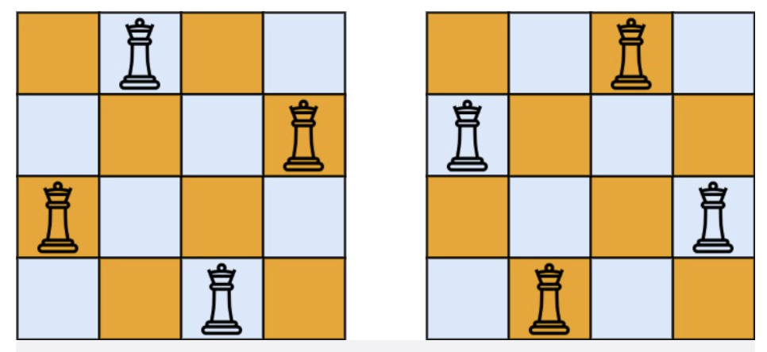

# 题目

n  皇后问题 研究的是如何将 n  个皇后放置在 n×n 的棋盘上，并且使皇后彼此之间不能相互攻击。

给你一个整数 n ，返回所有不同的  n  皇后问题 的解决方案。

每一种解法包含一个不同的  n 皇后问题 的棋子放置方案，该方案中 'Q' 和 '.' 分别代表了皇后和空位。

示例 1：



```
输入：n = 4
输出：[[".Q..","...Q","Q...","..Q."],["..Q.","Q...","...Q",".Q.."]]
解释：如上图所示，4 皇后问题存在两个不同的解法。
```

示例 2：

```
输入：n = 1
输出：[["Q"]]
```

提示：

- 1 <= n <= 9

# 解题思路

# 代码实现

```javascript
/**
 * @param {number} n
 * @return {string[][]}
 */
let res = [];
let column = [];
let diagonal1 = {};
let diagonal2 = {};
var solveNQueens = function (n) {
  res = [];
  column = Array(n).fill(false);
  diagonal1 = {};
  diagonal2 = {};
  dfs(n, [], 0);
  return res;
};

var dfs = function (n, path, rowNum) {
  if (rowNum === n) {
    res.push([...path]);
    return;
  }
  let str = Array(n).fill(".");
  let i = rowNum;
  for (let j = 0; j < n; j++) {
    let k1 = i + j;
    let k2 = i - j + n;
    if (column[j] || diagonal1[k1] || diagonal2[k2]) {
      continue;
    }
    column[j] = true;
    diagonal1[k1] = true;
    diagonal2[k2] = true;
    str[j] = "Q";
    path.push(str.join(""));
    dfs(n, path, rowNum + 1);

    str[j] = ".";
    column[j] = false;
    diagonal1[k1] = false;
    diagonal2[k2] = false;
    path.pop();
  }
};
```
