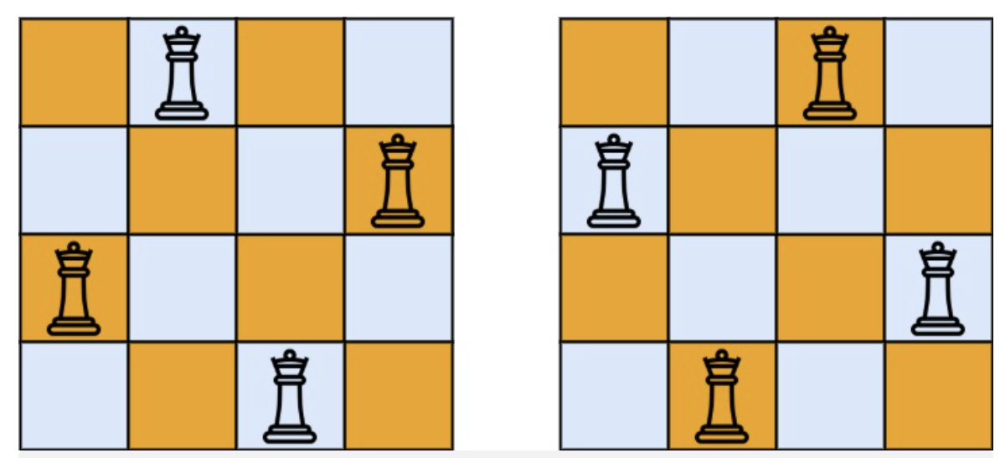

# 题目

n  皇后问题 研究的是如何将 n  个皇后放置在 n × n 的棋盘上，并且使皇后彼此之间不能相互攻击。

给你一个整数 n ，返回 n 皇后问题 不同的解决方案的数量。

示例 1：



```
输入：n = 4
输出：2
解释：如上图所示，4 皇后问题存在两个不同的解法。
```

示例 2：

```
输入：n = 1
输出：1
```

提示：

- 1 <= n <= 9

# 解题思路

# 代码实现

```javascript
/**
 * @param {number} n
 * @return {number}
 */
let count = 0;
let column = [];
let diagonal1 = {};
let diagonal2 = {};
var totalNQueens = function (n) {
  count = 0;
  column = Array(n).fill(false);
  diagonal1 = {};
  diagonal2 = {};
  dfs(n, 0);
  return count;
};

var dfs = function (n, rowNum) {
  if (rowNum === n) {
    count++;
    return;
  }
  let i = rowNum;
  for (let j = 0; j < n; j++) {
    let k1 = i + j;
    let k2 = i - j + n;
    if (column[j] || diagonal1[k1] || diagonal2[k2]) {
      continue;
    }
    column[j] = true;
    diagonal1[k1] = true;
    diagonal2[k2] = true;
    dfs(n, rowNum + 1);

    column[j] = false;
    diagonal1[k1] = false;
    diagonal2[k2] = false;
  }
};
```
