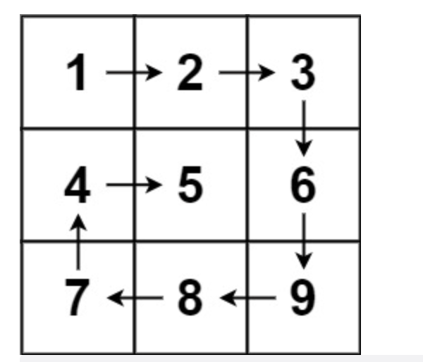
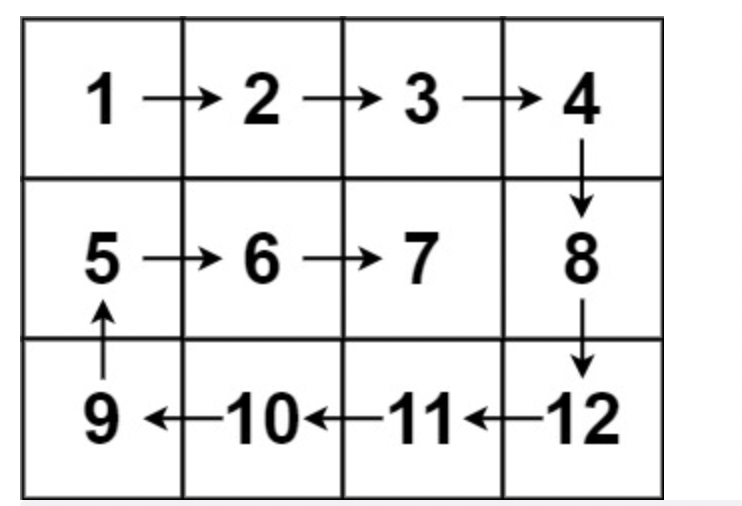

# 题目

给你一个 m 行 n 列的矩阵 matrix ，请按照 顺时针螺旋顺序 ，返回矩阵中的所有元素。

示例 1：



```
输入：matrix = [[1,2,3],[4,5,6],[7,8,9]]
输出：[1,2,3,6,9,8,7,4,5]
```

示例 2：



```
输入：matrix = [[1,2,3,4],[5,6,7,8],[9,10,11,12]]
输出：[1,2,3,4,8,12,11,10,9,5,6,7]
```

提示：

- m == matrix.length
- n == matrix[i].length
- 1 <= m, n <= 10
- -100 <= matrix[i][j] <= 100

# 解题思路

# 代码实现

```javascript
/**
 * @param {number[][]} matrix
 * @return {number[]}
 */
var spiralOrder = function (matrix) {
  let x = 0;
  let y = 0;
  let xData = [0, 1, 0, -1];
  let yData = [1, 0, -1, 0];
  let count = 0;
  let res = [];
  let m = matrix.length;
  let n = matrix[0].length;
  let data = {};
  while (res.length < m * n) {
    let cell = matrix[x][y];
    res.push(cell);
    data[x + "-" + y] = true;
    let x1 = x + xData[count];
    let y1 = y + yData[count];
    if (x1 < 0 || x1 > m - 1 || y1 < 0 || y1 > n - 1 || data[x1 + "-" + y1]) {
      count = (count + 1) % 4;
    }
    x = x + xData[count];
    y = y + yData[count];
  }
  return res;
};
```
