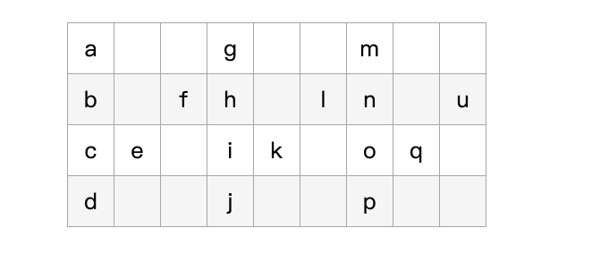

# 题目

将一个给定字符串 s 根据给定的行数 numRows ，以从上往下、从左到右进行 Z 字形排列。  
比如输入字符串为 "PAYPALISHIRING" 行数为 3 时，排列如下：

```
P   A   H   N
A P L S I I G
Y   I   R
```

之后，你的输出需要从左往右逐行读取，产生出一个新的字符串，比如："PAHNAPLSIIGYIR"。  
请你实现这个将字符串进行指定行数变换的函数：  
string convert(string s, int numRows);

示例 1：

```
输入：s = "PAYPALISHIRING", numRows = 3
输出："PAHNAPLSIIGYIR"
```

示例 2：

```
输入：s = "PAYPALISHIRING", numRows = 4
输出："PINALSIGYAHRPI"
```

解释：

```
P     I    N
A   L S  I G
Y A   H R
P     I
```

示例 3：

```
输入：s = "A", numRows = 1
输出："A"
```

提示：

- 1 <= s.length <= 1000
- s 由英文字母（小写和大写）、',' 和 '.' 组成
- 1 <= numRows <= 1000

# 解题思路

这里以一个输入行数为**4**，字符串 **abcdefghijklmnopqu** 为例子来说明。  
根据题意，接下来要排列的结果是下面这样的：



那我们再来看下存放在这些位置对应的字符串下标都是怎样的，如下图：


然后我们来看看这些下标都有什么规律：  
**第一行**：0，6，12, ...  
**最后一行**：3，9，15, ...

这两行的数据比较简单的可以看出来，都是一个公差为 6 的等差数列， 其中公差和要输出的行数的关系是：6 = 2\*4-2。  
此时我们要输出的行数记为 n, 那可以推出公差的计算是： 公差=2n-2

此时到这里我们能得到的第一行和最后一行这些字符串对应的原字符串下标就是这些：  
**第一行**：0, 0+(2n-2) ...  
**最后一行**： n-1, n-1 + (2n-2) ...

那中间那些行数呢，来看看这个例子中的中间那几行的下标有什么规律：  
**第二行**：1，5，7，11，13，17，...  
**第三行**：2，4，8，10，14，16，...

看起来似乎毫无规律。当时我们细看可以看到
第二行中：1，7，13 和 5，11，17 跳着看其实也是一个等差数列，而且公差跟我们第一行和最后一行的推导结果是一样的，为 2n-2。  
第三行中也有这样的规律。

没错，中间行我们可以看成是两个等差数列的重合。  
对应从每行的第一位开始形成的等差数列，该数列的第一项我们很好确定，就是每行的第一项。  
那那个嵌在中间的等差数列第一项是哪个，如何确定？  
我们看到：  
**第二行中的前两项**：1，5  
**第三行中的前两项**：2，4

其中有这样的规律：
1+5 = 2+4 = 6 = 2n-2 = 公差 （这个解题思路例子中的 n 是 4，因为要输出的行数是 4）

那这样我们就可以通过这个来计算出中间这个等差数列的第一项了，那中间这个等差数列后面的这些数值自然也能计算得到。

中间行第一项对应的下标值就是当前遍历到的行,我们记为 **i**  
第二项的下标值我们记为**j**, j = (2n-2) - i

到这里我们能得到中间行的这些字符串对应原字符串的下标是以下这些：  
**中间行**： i, j, i+(2n-2), j+(2n-2)

经过以上这些，我们能得每一行都存放了原字符串中的哪些位置的字符，此时我们只需要用一个循环在规定变换的行数范围内进行遍历，把每行计算得到的下标值去取原字符串中对应的字符，然后拼接起来，就是要求变换后按行读取的字符串了。

当然这里举例只用 4 行来说明下思路，对于推导结果的验证，大家再多试试其他行数去看看便可。

**时间复杂度**：O(n)

# 代码实现

```javascript
/**
 * @param {string} s
 * @param {number} numRows
 * @return {string}
 */
var convert = function (s, numRows) {
  if (numRows === 1) {
    return s;
  }
  var res = "";
  for (var i = 0; i < numRows; i++) {
    if (i === 0 || i === numRows - 1) {
      var index = i;
      while (index < s.length) {
        res = res + s[index];
        index = index + (2 * numRows - 2);
      }
    } else {
      var index1 = i;
      var index2 = 2 * numRows - 2 - i;
      while (index1 < s.length || index2 < s.length) {
        if (index1 < s.length) {
          res = res + s[index1];
        }
        if (index2 < s.length) {
          res = res + s[index2];
        }
        index1 = index1 + (2 * numRows - 2);
        index2 = index2 + (2 * numRows - 2);
      }
    }
  }
  return res;
};
```
