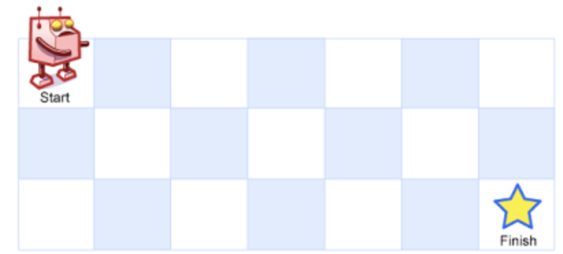

# 题目

一个机器人位于一个 m x n  网格的左上角 （起始点在下图中标记为 “Start” ）。

机器人每次只能向下或者向右移动一步。机器人试图达到网格的右下角（在下图中标记为 “Finish” ）。

问总共有多少条不同的路径？

示例 1：



```
输入：m = 3, n = 7
输出：28
```

示例 2：

```
输入：m = 3, n = 2
输出：3
解释：
从左上角开始，总共有 3 条路径可以到达右下角。

1. 向右 -> 向下 -> 向下
2. 向下 -> 向下 -> 向右
3. 向下 -> 向右 -> 向下
```

示例 3：

```
输入：m = 7, n = 3
输出：28
```

示例 4：

```
输入：m = 3, n = 3
输出：6
```

提示：

- 1 <= m, n <= 100
- 题目数据保证答案小于等于 2 \* 109

# 解题思路

- 中间的数字表示到达该格子的方案数

| 坐标 | 0   | 1   | 2   | 3   |
| ---- | --- | --- | --- | --- |
| 0    | 1   | 1   | 1   | 1   |
| 1    | 1   | 2   | 3   | 4   |
| 2    | 1   | 3   | 6   | 10  |
| 3    | 1   | 4   | 10  | 20  |

# 代码实现

```javascript
/**
 * @param {number} m
 * @param {number} n
 * @return {number}
 */
var uniquePaths = function (m, n) {
  let res = Array(m).fill([]);
  for (let i = 0; i < n; i++) {
    res[i] = Array(n).fill(0);
  }
  for (let i = 0; i < m; i++) {
    for (let j = 0; j < n; j++) {
      if (i === 0 && j === 0) {
        res[i][j] = 1;
      } else if (i === 0) {
        res[i][j] = res[i][j - 1];
      } else if (j === 0) {
        res[i][j] = res[i - 1][j];
      } else {
        res[i][j] = res[i][j - 1] + res[i - 1][j];
      }
    }
  }
  return res[m - 1][n - 1];
};
```
