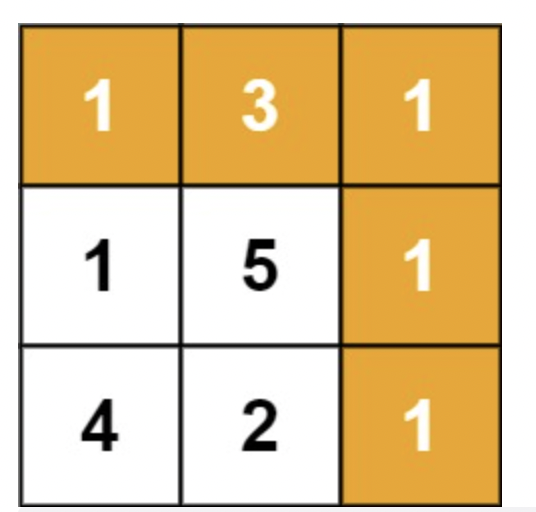

# 题目

给定一个包含非负整数的 m x n  网格  grid ，请找出一条从左上角到右下角的路径，使得路径上的数字总和为最小。

说明：每次只能向下或者向右移动一步。

示例 1：



```
输入：grid = [[1,3,1],[1,5,1],[4,2,1]]
输出：7
解释：因为路径 1→3→1→1→1 的总和最小。
```

示例 2：

```
输入：grid = [[1,2,3],[4,5,6]]
输出：12
```

提示：

- m == grid.length
- n == grid[i].length
- 1 <= m, n <= 200
- 0 <= grid[i][j] <= 100

# 解题思路

思路同第 62 题，只是这里每个格子求的是能到这个格子的路径的和的最小值。  
即正上方的格子+当前格子，左边格子+当前格子的值，两个取最小。  
若是在第一行，则直接 左边格子+当前格子 求和  
若是第一列，则直接 正上方格子+当前格子 求和

# 代码实现

```javascript
/**
 * @param {number[][]} grid
 * @return {number}
 */
var minPathSum = function (grid) {
  let m = grid.length;
  let n = grid[0].length;
  let res = Array(m).fill([]);
  for (let i = 0; i < m; i++) {
    res[i] = Array(n).fill(Number.MAX_SAFE_INTEGER);
  }
  console.log(res);
  for (let i = 0; i < m; i++) {
    for (let j = 0; j < n; j++) {
      if (i === 0 && j === 0) {
        res[i][j] = grid[i][j];
      }
      if (i > 0) {
        res[i][j] = Math.min(res[i][j], res[i - 1][j] + grid[i][j]);
      }
      if (j > 0) {
        res[i][j] = Math.min(res[i][j], res[i][j - 1] + grid[i][j]);
      }
    }
  }
  return res[m - 1][n - 1];
};
```
