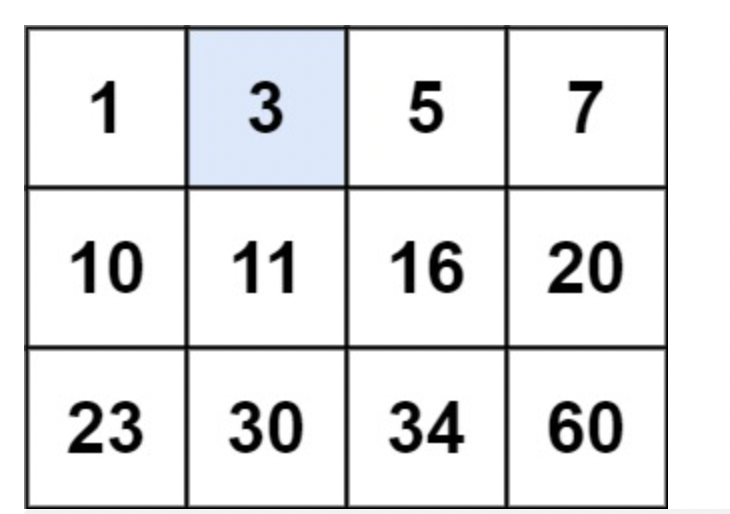
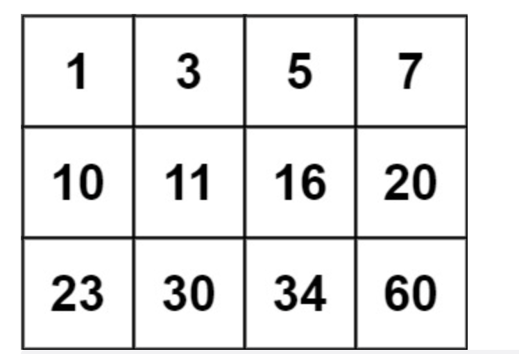

# 题目

编写一个高效的算法来判断  m x n  矩阵中，是否存在一个目标值。该矩阵具有如下特性：

每行中的整数从左到右按升序排列。
每行的第一个整数大于前一行的最后一个整数。

示例 1：



```
输入：matrix = [[1,3,5,7],[10,11,16,20],[23,30,34,60]], target = 3
输出：true
```

示例 2：



```
输入：matrix = [[1,3,5,7],[10,11,16,20],[23,30,34,60]], target = 13
输出：false
```

提示：

- m == matrix.length
- n == matrix[i].length
- 1 <= m, n <= 100
- -104 <= matrix[i][j], target <= 104

# 解题思路

# 代码实现

```javaScript
/**
 * @param {number[][]} matrix
 * @param {number} target
 * @return {boolean}
 */
var searchMatrix = function(matrix, target) {
    let m = matrix.length;
    let n = matrix[0].length;
    let left = 0;
    let right = m*n-1;
    while (left < right) {
        let mid = Math.ceil((left + right)/2);
        let x = Math.floor(mid/n);
        let y = mid % n;
        if (matrix[x][y] <= target) {
            left = mid;
        } else {
            right = mid - 1;
        }
    }
    let x = Math.floor(right/n);
    let y = right % n;
    return matrix[x][y] === target;
};
```
