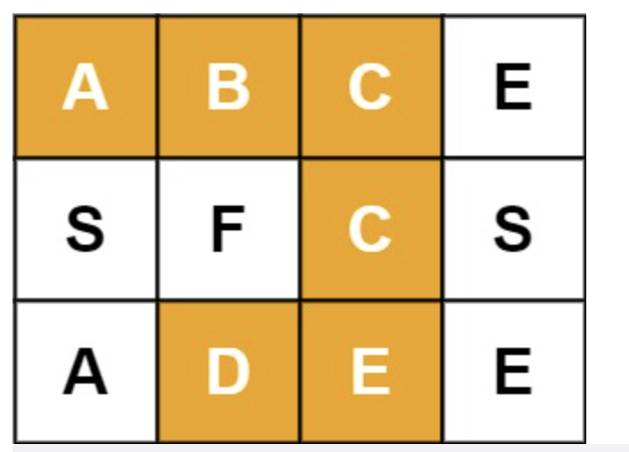
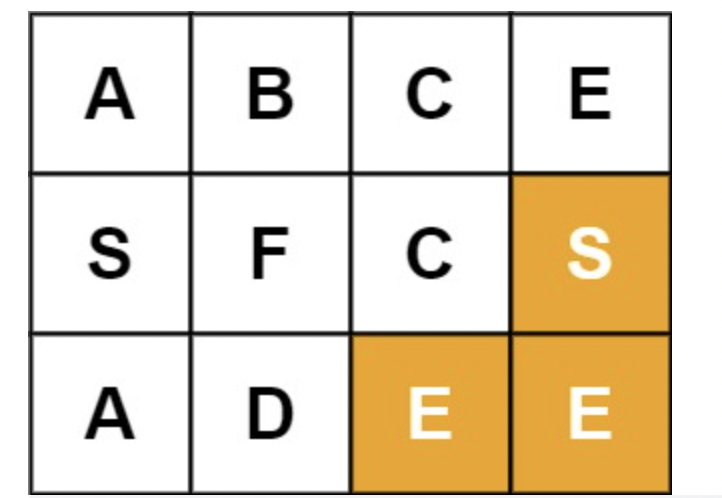
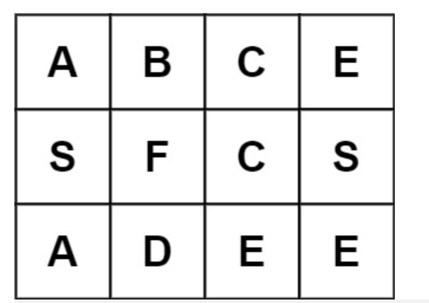

# 题目

给定一个  m x n 二维字符网格  board 和一个字符串单词  word 。如果  word 存在于网格中，返回 true ；否则，返回 false 。

单词必须按照字母顺序，通过相邻的单元格内的字母构成，其中“相邻”单元格是那些水平相邻或垂直相邻的单元格。同一个单元格内的字母不允许被重复使用。

示例 1：



```
输入：board = [["A","B","C","E"],["S","F","C","S"],["A","D","E","E"]], word = "ABCCED"
输出：true
```

示例 2：



```
输入：board = [["A","B","C","E"],["S","F","C","S"],["A","D","E","E"]], word = "SEE"
输出：true
```

示例 3：



```
输入：board = [["A","B","C","E"],["S","F","C","S"],["A","D","E","E"]], word = "ABCB"
输出：false
```

提示：

- m == board.length
- n = board[i].length
- 1 <= m, n <= 6
- 1 <= word.length <= 15
- board 和 word 仅由大小写英文字母组成

进阶：你可以使用搜索剪枝的技术来优化解决方案，使其在 board 更大的情况下可以更快解决问题？

# 解题思路

# 代码实现

```javaScript
/**
 * @param {character[][]} board
 * @param {string} word
 * @return {boolean}
 */
var exist = function(board, word) {
    for(let i = 0; i < board.length; i++) {
        for (let j = 0; j < board[0].length; j++) {
            let t = board[i][j];
            board[i][j] = '.';
            if (dfs(board, word, 0, i, j, t)) {
                return true;
            }
            board[i][j] = t;
        }
    }
    return false;
};

var dfs = function(board, word, n, x, y, cur) {
    if (word[n] !== cur) {
        return false;
    }
    if (word.length - 1 === n) {
        return true;
    }
    let dx = [-1, 0, 1, 0];
    let dy = [0, 1, 0, -1];
    for (let i = 0; i < 4; i++) {
        let x1 = x + dx[i];
        let y1 = y + dy[i];
        if (x1 < 0 || x1 >= board.length || y1 < 0 || y1 >= board[0].length || board[x1][y1] === '.') {
            continue;
        }
        let t = board[x1][y1];
        board[x1][y1] = '.';
        if (dfs(board, word, n + 1, x1, y1, t)) {
            return true;
        }
        board[x1][y1] = t;
    }
}
```
