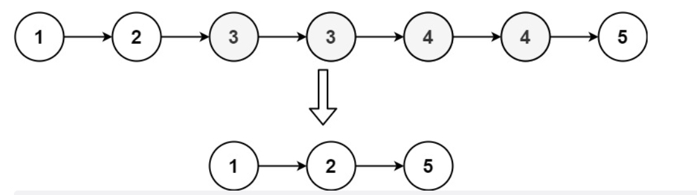
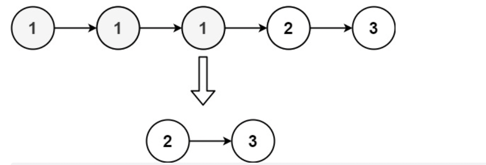

# 题目

给定一个已排序的链表的头  head ，  删除原始链表中所有重复数字的节点，只留下不同的数字  。返回 已排序的链表  。

示例 1：



```
输入：head = [1,2,3,3,4,4,5]
输出：[1,2,5]
```

示例 2：



```
输入：head = [1,1,1,2,3]
输出：[2,3]
```

提示：

- 链表中节点数目在范围 [0, 300] 内
- -100 <= Node.val <= 100
- 题目数据保证链表已经按升序 排列

# 解题思路

# 代码实现

```javaScript
/**
 * Definition for singly-linked list.
 * function ListNode(val, next) {
 *     this.val = (val===undefined ? 0 : val)
 *     this.next = (next===undefined ? null : next)
 * }
 */
/**
 * @param {ListNode} head
 * @return {ListNode}
 */
var deleteDuplicates = function(head) {
    let map = {};
    let p = head;
    while(p) {
        map[p.val] = map[p.val] ? map[p.val] + 1 : 1;
        p = p.next;
    }
    let node = new ListNode();
    node.next = head;
    p = node;

    while(p && p.next) {
        let n = p.next;
        if (map[n.val] > 1) {
            p.next = n.next;
        } else {
            p = p.next;
        }
    }
    return node.next;
};
```
