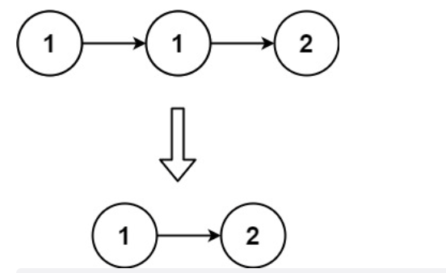
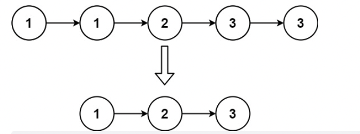

# 题目

给定一个已排序的链表的头  head ，  删除所有重复的元素，使每个元素只出现一次  。返回 已排序的链表  。

示例 1：



```
输入：head = [1,1,2]
输出：[1,2]
```

示例 2：



```
输入：head = [1,1,2,3,3]
输出：[1,2,3]
```

提示：

- 链表中节点数目在范围 [0, 300] 内
- -100 <= Node.val <= 100
- 题目数据保证链表已经按升序 排列

# 解题思路

# 代码实现

```javaScript
/**
 * Definition for singly-linked list.
 * function ListNode(val, next) {
 *     this.val = (val===undefined ? 0 : val)
 *     this.next = (next===undefined ? null : next)
 * }
 */
/**
 * @param {ListNode} head
 * @return {ListNode}
 */
var deleteDuplicates = function(head) {
    let p = head;
    while(p && p.next) {
        let n = p.next;
        if (p.val === n.val) {
            p.next = n.next;
        } else {
            p = p.next;
        }
    }
    return head;
};
```
