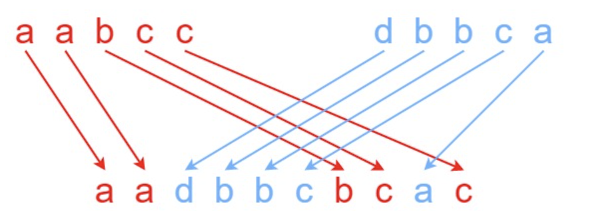

# 题目

给定三个字符串  s1、s2、s3，请你帮忙验证  s3  是否是由  s1  和  s2 交错 组成的。

两个字符串 s 和 t 交错 的定义与过程如下，其中每个字符串都会被分割成若干 非空 子字符串：

s = s1 + s2 + ... + sn
t = t1 + t2 + ... + tm
|n - m| <= 1
交错 是 s1 + t1 + s2 + t2 + s3 + t3 + ... 或者 t1 + s1 + t2 + s2 + t3 + s3 + ...
注意：a + b 意味着字符串 a 和 b 连接。

示例 1：



```
输入：s1 = "aabcc", s2 = "dbbca", s3 = "aadbbcbcac"
输出：true
```

示例 2：

```
输入：s1 = "aabcc", s2 = "dbbca", s3 = "aadbbbaccc"
输出：false
```

示例 3：

```
输入：s1 = "", s2 = "", s3 = ""
输出：true
```

提示：

- 0 <= s1.length, s2.length <= 100
- 0 <= s3.length <= 200
- s1、s2、和 s3 都由小写英文字母组成

- 进阶：您能否仅使用 O(s2.length) 额外的内存空间来解决它?

# 解题思路

动态规划

# 代码实现

```javaScript
/**
 * @param {string} s1
 * @param {string} s2
 * @param {string} s3
 * @return {boolean}
 */
var isInterleave = function(s1, s2, s3) {
    if (s1.length + s2.length !== s3.length) {
        return false;
    }
    s1 = ' ' + s1;
    s2 = ' ' + s2;
    s3 = ' ' + s3;
    let m = s1.length;
    let n = s2.length;
    let res = Array(m).fill([]);
    for (let i = 0; i < m; i++) {
        res[i] = Array(n).fill(false);
    }
    for (let i = 0; i < m; i++) {
        for (let j = 0; j < n; j++) {
            if (i === 0 && j === 0) {
                res[i][j] = true;
                continue;
            }
            if (s1[i] === s3[i+j]) {
                res[i][j] = res[i-1][j];
            }
            if (s2[j] === s3[i+j]) {
                res[i][j] = res[i][j] || res[i][j-1];
            }
        }
    }
    return res[m-1][n-1];
};
```
