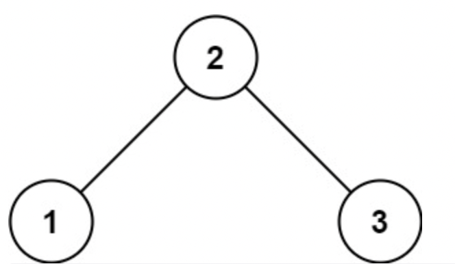
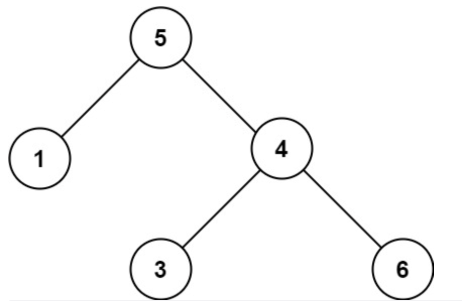

# 题目

给你一个二叉树的根节点 root ，判断其是否是一个有效的二叉搜索树。

有效 二叉搜索树定义如下：

节点的左子树只包含 小于 当前节点的数。
节点的右子树只包含 大于 当前节点的数。
所有左子树和右子树自身必须也是二叉搜索树。

示例 1：



```
输入：root = [2,1,3]
输出：true
```

示例 2：



```
输入：root = [5,1,4,null,null,3,6]
输出：false
解释：根节点的值是 5 ，但是右子节点的值是 4 。
```

提示：

- 树中节点数目范围在[1, 104] 内
- -231 <= Node.val <= 231 - 1

# 解题思路

# 代码实现

```javaScript
/**
 * Definition for a binary tree node.
 * function TreeNode(val, left, right) {
 *     this.val = (val===undefined ? 0 : val)
 *     this.left = (left===undefined ? null : left)
 *     this.right = (right===undefined ? null : right)
 * }
 */
/**
 * @param {TreeNode} root
 * @return {boolean}
 */
let res = [];
var isValidBST = function(root) {
    res = []
    return dfs(root);
};

var dfs = function(node) {
    if (!node) {
        return true;
    }
    if (!dfs(node.left)) {
        return false;
    }
    if (!res.length || (res.length > 0 && res[res.length-1] < node.val)) {
        res.push(node.val);
    } else {
        return false;
    }
    if (!dfs(node.right)) {
        return false;
    }
    return true;
}
```
